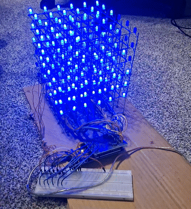

# LED Matrix

## Description

Data generators and Arduino driver (program) for a 6x6x6 LED matrix. The latest revision is `matrix_direct_drive` and uses low-level PORT manipulation which is faster in comparison to using digitalWrite. There are pre-programmed animations written in the Arduino program, but the matrix can be controlled by sending data over serial. The data format is packed byte data. Use `play_animation_3.py` to send the data.

## Photos

## TO-DO

Remove redundant files.